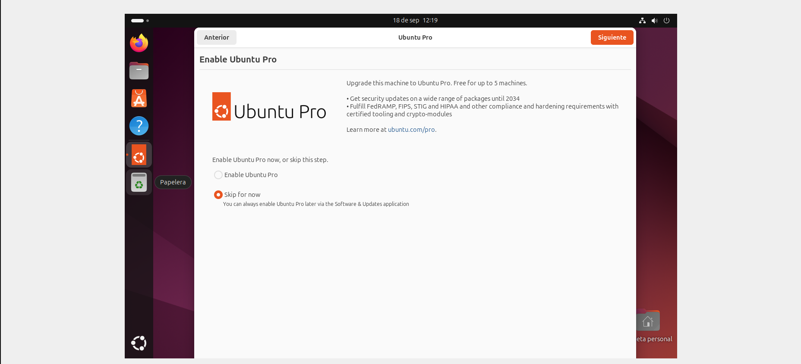
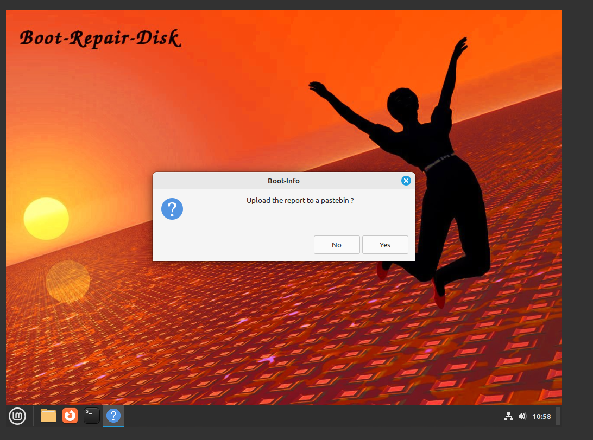

## Instal·lació, Configuració Inicial i Programari de Base
En aquesta primera part veurem el procés d'instal·lació d'una màquina virtual, les llicències que té, com generar punts de restauració, com es fa la configuració de la xarxa, a instal·lar el programari i finalment com funciona un gestor d'arrancada.

## Instal·lació
En aquest apartat veurem pas per pas com fer la instal·lació d'Ubuntu i les particions que li donarem al disc en el nostre cas.

- Primerament, hem de crear una màquina nova amb la imatge ISO, seguidament li donarem l'emmagatzematge, processadors i RAM. Un cop fet aquest pas abans de començar la instal·lació hem de configurar la xarxa des de les eines, en aquest cas escollim una NAT.

- A les opcions de xarxa ens connectem a la xarxa NAT que hem creat prèviament.

- Un cop tenim la configuració prèvia, comencem la instal·lació. Entrem a l'opció d'instal·lar.

- Seugidament triem l'idioma

- A continuació les opcions d'accessibilitat, disposició del teclat, la connexió a internet i per últim seleccionem l'opció d'instal·lar Ubuntu amb l'opció interactiva i seguidament la selecció predeterminada. No instal·larem els programes recomanats.

- En aquesta opció de configuració seleccionarem la manual, aquí podrem determinar les parts del disc i segons la necessitat donar-li més o menys espai a cada part.
- En primera part designarem un espai de 5GB amb un format SWAP. A continuació un espai per a /home que és la carpeta on aniran les aplicacions i documents, per tant, li donarem 30GB amb format Ext4. I en conclusió un espai de 18,68GB a la partició on anirà situat el sistema operatiu.

- Per anar acabant amb la instal·lació crearem un compte al nostre gust.

- Finalment, podem revisar les nostres opcions abans d'instal·lar. Un cop acabat reiniciem l'Ubuntu i ja el tenim preparat per fer-lo servir.

## Llicenciament 

Programari Lliure (PL): ha de complir 4 llibertats:

- Utilitzar-lo sense condicions

- Estudiar-lo i adaptar-lo a les pròpies necessitats

- Distribuir-lo

- Millorar-lo i distribuir les modificacions

### - Llicencia CC
La llicencia CC es una eina legal i gratuita que permet protegir les obres amb drets d'autor. En aquest cas aquesta pàgina utilitzarà una CC: BY NC SA.

Aquesta simbologia significa que s'ha d'atribuir l'autoria, permet l'edició, no permet l'us comercial i permet la modificació i distribució.
### - Ubuntu
Ubuntu es sistema operatiu de codi obert i gratuit, utilitza la llicencia GNU (General public license: [gnu.org](https://www.gnu.org/licenses/fdl-1.3.html)), aquesta llicencia permet la copia, distribució i modificació del codi.  

## Punts de restauració
### - Concepte en ubuntu
Amb el sistema operatiu d'ubuntu
ex4 no porta punts de restauració
sistema de fitxers d'instantenes que treballa en volums = btrfs, no partició. L'eina del timeshift fa imatges del sistema a les que es poden tornar.

- En primer lloc, des del terminal instal·larem el timeshift tal com s'indica a les imatges.

- Un cop tenim el timeshift instal·lat l'executem i el configurem, el programa ens permet guardar en quin estat es troben les carpetes que tenim al nostre dispositiu, amb aquest punt guardat podrem tornar amb cas de pèrdua de dades o mal funcionaments. A més a més, el timeshift té l'opció de crear punts de restauració per dia, hora, més o setmana.

- Seguim la configuració predeterminada.

- Un cop feta la configuració crearem una carpeta per comprovar el funcionament. I seguidament instaurem el punt de restauració i on el guardem.

- Com es pot comprovar a la següent imatge, ja tenim la instantània creada.

- Per acabar posarem en prova el seu funcionament, en aquest cas s'elimina la carpeta "hola", un cop esborrada anem a l'instantània i la restaurem, un cop acaba el procés podem observar que la carpeta s'ha restaurat.

## Configuració de xarxa bàsica
Per configurar la xarxa en primera instancia podem veure la configuració a través dels paràmetres a l'opció de xarxa. Des d'aquest punt entrem a les opcions del cablejat per comprovar quina IP tenim i amb el mode manual la podem canviar al nostre gust.

- Seguidament obrim la terminal i amb un ping comprovem que la connexió s'hagi establert correctament.

- L'altra opció per configurar la xarxa es utilitzant el terminal i canviant el netplan, en aquest cas em d'editar l'arxiu network manager.

- A continuació em de guardar a l'arxiu, l'adressa i les rutes com es mostra a la següent imatge. Un cop fet això guardem l'arxiu i apliquem el "netplan" amb una comanda.

- Finalment comprovem amb un altre ping si la connexió funciona correctament.

## Instalacions de programari
En aquesta secció veurem com instal·lar diversos programes amb diferents tipus d'executables i com fer-ho desde el terminal. És important saber que en Ubuntu podem instal·lar programes i apliacacions desde l'App center.

- En primer lloc farem una actualització de les apliacacions ja instalades.

- Amb la següent comanda eliminarem paquets del SO que ja no s'utilitzen.

- Per als paquets .deb utilitzarem la comanda dpkg -i, en aquest cas instal·larem el Pacman. Per assegurar-nos de que ho hem instal·lat correctament hi ha la comanda de dpkg -get-selections | grep pacman . Com es veu a la següent imatge la instal·lació s'ha realitzat correctament i s'executa. En casos d'error podem provar altres comandes com ara dpkg -r, dpkg -P.

 
- Per desinstal·lar paquets podem utilitzar la comanda apt remove paquet, també podem utilitzar apt purge paquet, que ens eliminarà també les configuracions. Per comprovar que hem eliminat correctament el paquet podem fer el següent.

- Un altra part important a l'hora d'instal·lar programari es saber que moltes vegades els arxius que ens descarregem es troben comprimits amb diferents tipus de formats, ja poden ser els .rar, .zip, .gz, .tar, etc... Per descomprimir aquests arxius podem utilitzar varies comandes segons la seva extensió: 
tar xvf arxiu.tar
gunzip arxiu.gz
bunzip2 arxiu.bz2
rar -x arxiu.rar
unzip arxiu.zip
- Un cop estan les carpetes descomprimides ens mourem dins de la carpeta amb la comanda cd, un cop estem situats al directori utilitzarem la comanda ./configure i seguidament amb el make install instal·larem l'aplicació, en cas de voler-la desinstal·lar el que em fet podem entrar un altre cop al directori i fer servir la comanda make uninstall.

## Gestors d'arrancada
Un gestor d'arranc es una eina que es troba a una partició del disc, la MBR (master boot record), i es la que fa que ens carregui el sistema operatiu. En aquest cas Ubuntu instal·la per defecte el GRUB, es el software que ens farà arrancar el sistema. 

Per recuperar el gestor d'arranc podem utilitzar algunes eines en aquest cas n'he documentat dos, el bootrepair i el grub2.
### - Bootrepair
- En primer lloc eliminarem la carpeta grub del sistema

- A continuació veurem que no ens arranca el sistema, llavors instalem la iso del bootrepair a la màquina virtual i arrancarem el sistema amb el bootrepair.

- Un cop arranquem amb el bootrepair és molt senzill, sol hem de seguir els passos que ens dona el propi sitstema tal i com es mostra a continuació.

- Un cop seguits tots els procediments recomanats del bootrepair sen's reiniciarà el sistema (nota: important demontar l'imatge ISO). A continuació veurem com el sistema arranca correctament.

### - Grub2
- Per començar repetim el primer pas de borrar la carpeta grub del nostre sistema.

- Seguidament instalem l'ISO del grub2 a la nostra màquina virutal.

- A continuació sen's executarà el menú del grub2, personalment el primer que he fet es canviar l'idioma. Després busquem l'opció de detectar els sistemes d'arrancada. Tindrem varies opcions, en aquest cas escollim la primera la generica de Linux. 

- Desrpés s'obrirà el sistema com de costum, un cop tenim el sistema obert em de seguir els següents pasos per restaurar la carpeta grub.

- Amb aquestes comandes el que fem es instalar la carpeta grub de nou amb els permisos root, i després l'actualitzem per assegurar-nos que contingui tot el necessari per una arrancada correcta del sistema. Com podem comprovar en l'última imatge. (nota: important eliminar la ISO del grub2 al tornar a arrencar el sistema).

