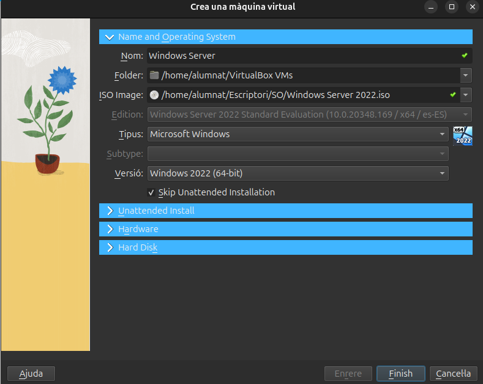
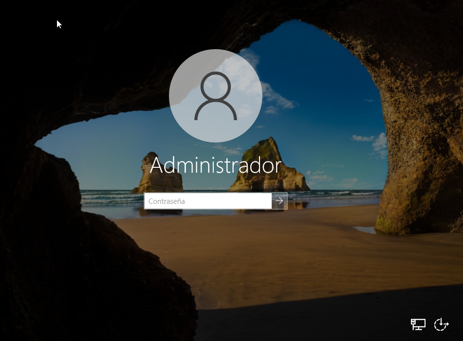
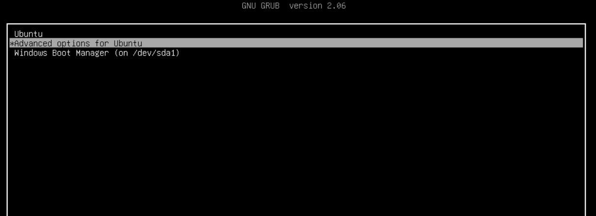
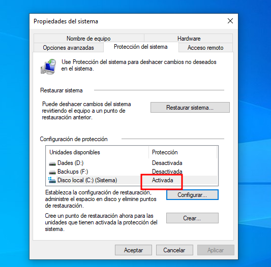
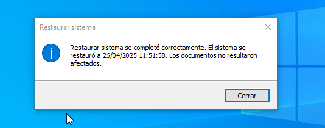

## Introducció
En aquest projecte veurem la funcionalitat del sistema operatiu Windows, el seu tipus de llicències i també identificarem els seus elements funcionals. Realitzarem la seva instal·lació i configuració, i mostrarem com configurar els serveis de xarxa i els seus protocols mitjançant màquines virtuals.

## Instal·lació Windows Server

- Per instal·lar un Windows Server en una màquina virtual, el primer que necessitarem serà una ISO del sistema operatiu. Després començarem amb una instal·lació creant una màquina nova amb VirtualBox.


- Els primers passos després d'afegir la ISO del sistema són donar les capacitats de la màquina de VirtualBox, tant la memòria RAM com el número de nuclis que utilitzarà el processador i la memòria física que tindrà la nostra màquina, tal com es mostra a continuació.


- Un cop confirmada la configuració, arrenquem la màquina i comencem la instal·lació del sistema, seguint els passos que es mostren.


- En aquest punt ens demanarà quina versió del sistema volem instal·lar. Escollirem la que ens facilita una interfície gràfica. I després acceptarem els termes de la llicència.


- Seguidament escollirem el tipus d'instal·lació personalitzada, per escollir les mides del disc de forma manual, en aquest cas volem que el sistema ocupi el 100% del disc.


- Finalment veurem que ja se'ns comença a instal·lar i simplement hem d'esperar.


- Un cop acabat esborrem la imatge ISO de la instal·lació i arrenquem la màquina de nou. A continuació haurem de configurar l'usuari administrador.




### - Configuració IP estàtica

- En aquest punt configurarem una IP estàtica, ja que ens interessa que el servidor sempre tingui la mateixa IP. Els passos a seguir són els següents: Entrar a la configuració de xarxa, Ethernet, opcions de l'adaptador, propietats de l'adaptador i a funcions de xarxa escollim IPv4. Un cop fet això escollim la IP, la màscara i la porta d'enllaç.


- Un cop tot configurat des del terminal o CMD comprovem que la IP sigui la configurada amb la comanda ```ipconfig```.


## Instal·lació Windows 10

- Com hem fet a l'apartat anterior seleccionarem la imatge ISO del sistema operatiu Windows 10, i un cop fet això donarem els paràmetres de la màquina virtual, tant de RAM com d'espai i nuclis.


- Un cop tenim feta la configuració de la màquina l'arrenquem i s'iniciarà l'instal·lador de Windows, seguirem els passos que hem vist en l'apartat anterior, ja que la instal·lació és molt similar.


- Un cop acabada la instal·lació esborrarem la imatge ISO d'instal·lació. I arrenquem la màquina de nou. Ara ens demanarà configurar l'usuari i una serie de funcionalitats de Windows, aquestes es poden escollir al nostre gust, jo en aquest cas les he rebutjat totes. Després ja podrem accedir amb normalitat.


### - Dual Windows + Ubuntu

El següent pas serà crear una partició apta per instal·lar un sistema operatiu ubuntu per fer una arrencada DUAL. El primer pas serà configurar la partició del nostre disc utilitzant l'eina del propi Windows el ```Disc Manager```.


- Un cop som dins de l'aplicació el que farem serà reduir l'espai del disc per generar una partició on poder instal·lar l'ubuntu, escollirem mes o menys la meitat del disc o unes 20 GB per a que el sistema tingui espai de sobra. Com podrem observar ens queda una partició buida no assignada.


- A continuació li donarem format a la partició que hem creat tal i com es mostra. El sistema de fitxers escollit es el NTFS, Linux es capaç de llegir aquest sistema de fitxers i ens farà l'instal·lació mes senzilla.


- Un cop tenim tot preparat amb el virtualbox afegim la imatge ISO d'Ubuntu, es important esborrar la part que posa que hi ha una unitat optica buida, sino l'instal·lador no arrencarà.


- Escollirem l'opció d'instal·lar ubuntu i començarem amb una configuració estandar com ja hem vist en projectes anteriors.


- En aquest cas i com linux pot reconeixer el windows tenim l'opció d'instl·lar ubuntu conjuntament amb el windows, i escollirem aquesta opció si no hem deixat un espai preparat. En aquest cas he esobrrat la partició que he fet i amb aquesta opció pots seleccionar les GB que vols que ocupi Ubuntu i el propi sistema ho fa, així no fa falta modificar el disc.


- Després podem seguir amb la instal·lació.


- Un cop ja s'ha acabat la instal·lació reiniciem el sistma i escollim ubuntu per comprovar si arrenca bé.




- Com podem veure Ubuntu arrenca i funciona correctament. A continuació per simular un problema amb el gestor d'arranc amb l'eina Gparted eliminarem la partició d'Ubuntu perque així també eliminarem el grub, i perdrem el gestor d'arrancada.


- Al acabar reiniciem el sistema i ens trobarem el següent error.


- Per solucionar aquest problema podem utilitzar l'eina de la ISO de windows de reparar sistema, per tant agregem la imatge i seguim els següents passos per arribar al terminal de comandes.


- Escollim l'opció de simbolo del sistema i a partir d'aquí executarem les següents comandes per activar el gestor d'arranc de windows.
```
diskpart
```
```
list disk
```
```
select disk nº
```
```
list partition
```
```
select partiton nº
```
```
active
```
```
exit
```
- I després
```
bootrec /fixmbr
```
```
bootrec /fixboot
```
```
bootrec /rebuildbcd
```
```
exit
```


- Un cop fet això reiniciem el sistema i ja podrem utilitzar Windows amb normalitat, per comprovar els canvis i l'estat dels disc he obert el gestor de discs, la part d'Ubuntu s'ha quedat esborrada però podriem recuperar l'espai.


## Punts de restauració i aplicacions
### - Punts de restauració

Per crear punts de restauració Windows disposa d'una eina gràfica que ens permet guardar l'estat d'un disc en el moment en que es realitza. Primerament, obrirem aquesta eina i a la configuració activarem la protecció del sistema tal com es mostra.


- Un cop fet això veurem que ja s'ha quedat activada la protecció del disc C, i podrem seguir creant el punt de restauració, amb l'opció ```crear```.




Ara ja tenim el punt de restaurció creat i per tal de comprovar el seu funcionament instal·larem alguna aplicació per fer canvis al disc.

### - Aplicacions + comprovació de la restauració

- En primer lloc ens descarregarem l'instal·lador de qualsevol aplicació, en aquest cas he escollit el Firefox. Un cop descarregat amb doble clic executarem l'instal·lador i el sistema ens mostrarà un missatge de confirmació.


- Seguidament al panell de control a la part de "programas y caracteristicas" podem consultar tots els programes i aplicacions que hi ha instal·lats al nostre sistema. Com es pot veure el Firefox esta instal·lat.


- Finalment, recuperarem l'estat anterior del sistema a partir del punt de restauració que s'ha fet prèviament. Per fer això tornarem a la configuració dels punts de restauració i anirem a l'apartat de "restaurar sistema", allà se'ns obrirà una nova finestra on escollirem el punt de restauració, si el seleccionem i continuem, començara la restauració.


- Una vegada s'ha reiniciat l'equip es mostrarà un missatge de que la restauració ha sigut completada i llavors mirarem si el Firefox ja no hi es.




## Llicències de Windows

Per accedir a un servidor de Windows hi ha un tipus de llicència anomenada ```CAL```. Aquesta és una llicència que utilitzen o bé els usuaris o bé els dispositius per connectar-se a un servidor de Windows. Això és degut al fet que la llicència de Windows d'un servidor només és útil per a un servidor, per tant si ens volem connectar amb diferents usuaris i/o dispositius necessitarem una llicència del tipus CAL.

Com ja s'ha esmentat abans per al propi servidor necessites una llicència, però també necessitarem per a cada dispositiu una llicència d'aquest mateix, per tant podem dir que per configurar un servidor necessitem la llicència pròpia d'un servidor, les llicències pròpies dels dispositius que es volen connectar i per últim les llicències CAL perquè aquests dispositius es connectin al servidor.

### - Tipus de CAL

Hi ha dos tipus de llicència CAL, aquestes són a nivell d'usuari i a nivell de dispositiu.

- La llicència de dispositiu pot ser útil si tenim en una sola màquina diversos usuaris i tots requereixen d'un accés al servidor.

- La llicència d'usuari pot ser útil en cas que un usuari es pugui connectar al servidor mitjançant diversos dispositius.

En definitiva, escollir el tipus de CAL es fa en funció de la necessitat de l'empresa en qüestió.

### - Tipus de llicències

Per cada versió del sistema operatiu tenim diferents tipus de llicencies:

- Home. Aquesta com el seu nom indica es per us domestic per tant no es pot unir a un domini ni permet connexions d'escriptori remot. No es recomana per un ús que no sigui el domestic.

- Pro. Aquesta llicència si permet unirse a un domini i permet la connexió remota, ja que es dedicada al sector professional, aquesta si que es recomanable per petites empreses. 

- Enterprise. Aquesta llicència les funcionalitats de la versió pro pero ampliades ja que esta pensat per una infraestructura de gran empresa, aquesta compta amb més funcions de seguretat i gestió avançada. Esta pensada per grans volums de dispositius i usuaris.

També cal afegir, que hi han llicencies com la d'education, la retail i la OEM, però aquestes no ens són molt interessants per als temes que estem tractant, simplement remarcar que hi han més tipus.

### - Enllaços d'informació de les llicències
```
https://vasyco.com/blog/tipos-licencias-windows/
```
```
https://www.microsoft.com/es-es/licensing/product-licensing/windows
```

