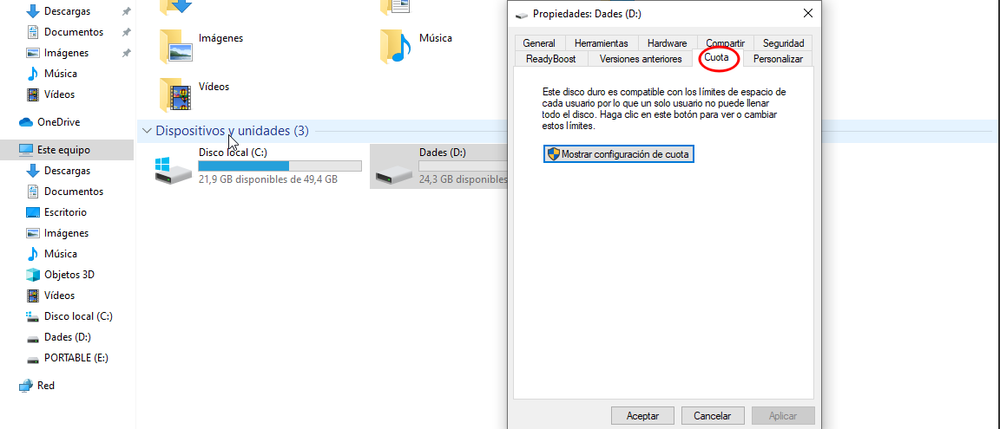
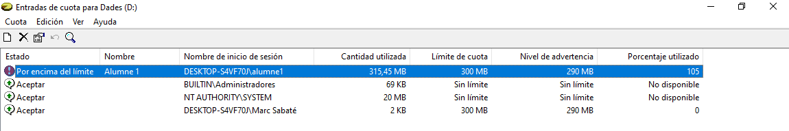
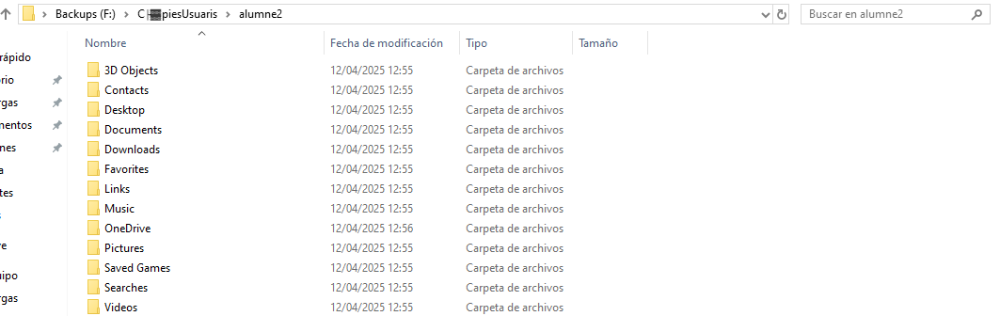
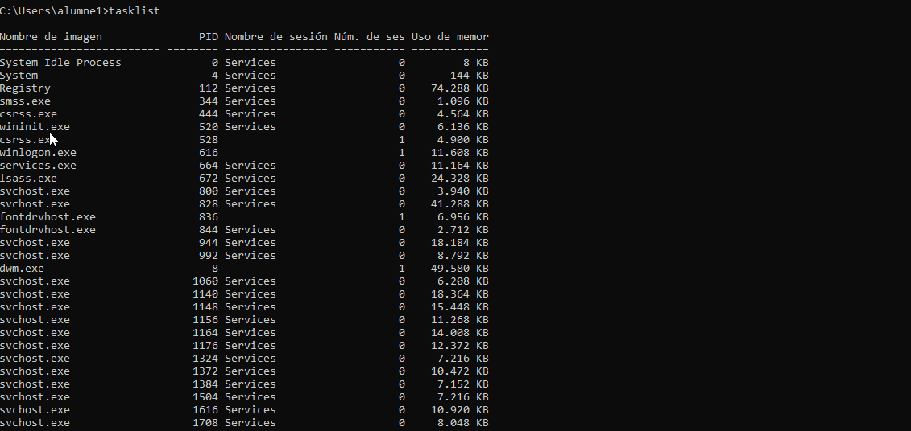
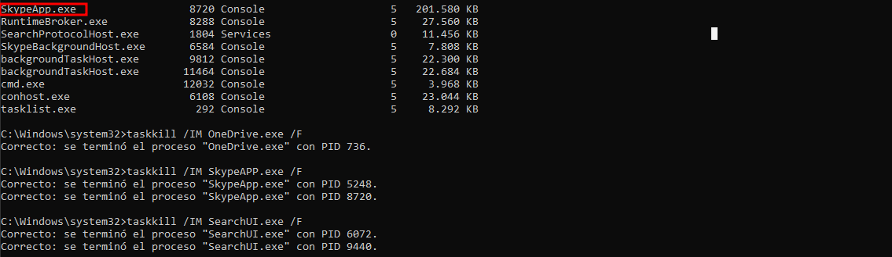
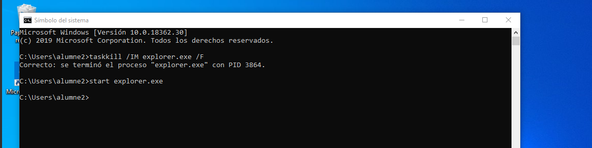

En aquest segon sprint veurem com gestionar i configurar usuaris i grups, establint els permisos i accessos adequats per a cada situació. També administrarem el sistema d'emmagatzematge i veurem com automatitzar algunes tasques a l'hora d'iniciar sessió amb els diferents usuaris.

## Quotes i usuaris

En primer lloc, afegirem un disc nou a la nostra màquina per fer proves. Com ja hem vist altres vegades, a la pestanya d'emmagatzematge afegirem un disc nou. Després, arrancarem el sistema de gestor de discs de Windows i configurarem dues particions: una amb el format NTFS que es dirà "Dades" i l'altra amb FAT32 que es dirà "Portable".


- Finalment, per comprovar si hem creat correctament aquestes particions des del terminal de comandes ```CMD```, executarem la comanda ```diskpart``` i podrem llistar els discs i els volums per comprovar el seu format i mida.


### - Quotes

Per continuar, anirem a l'explorador d'arxius i allà, amb el botó dret damunt del disc D que hem anomenat "Dades", obrirem les propietats i, a la pestanya "Quota", obrirem la configuració avançada.



- Seguidament, a la configuració habilitarem l'administració de quotes i limitarem l'espai del disc a 300 MB i un avís a 290 MB. També, si volguéssim, podríem denegar que l'usuari pogués superar aquest límit. I, per últim, activarem les opcions de registre. Un cop activada la configuració, ens sortirà la llum del semàfor en verd i un missatge del seu estat.


### - Usuaris

A continuació, i després de configurar la quota, procedirem a la creació dels usuaris. Per a això, obrirem l'aplicació "cuentas de usuario" i, a les opcions avançades, configurarem la creació d'aquests.


- A més a més, veurem que se'ns obre l'aplicació ```lusrmgr```, on podem configurar els usuaris i grups del sistema local. Per tant, escollim la carpeta dels usuaris i, amb el botó dret, afegim un usuari nou. Com que volem crear dos alumnes, afegirem tant l'alumne 1 com el 2, tal com es mostra.


- Tant bon punt acabem la creació d'aquests usuaris, veurem que ja disposem d'ells per fer les proves.


- Finalment, a la secció de grups, afegirem un grup nou tal com hem fet amb els usuaris i en crearem un que es digui "Limitats", que el formaran els dos alumnes creats anteriorment, afegint-los amb l'opció de "Agregar".


- Per acabar, comprovarem que puguem iniciar sessió amb els dos i que ens apareguin per poder fer-ho.


- Com a prova, amb l'alumne 1 excedirem la mida que poden utilitzar del disc D. L'avís que ens dona és que ha excedit el límit. Ens ha deixat sobrepassar-lo ja que així ho hem configurat.



## Còpies de seguretat i automatització

Per poder fer les còpies de seguretat afegirem un disc nou d'uns 10GB tal i com hem fet abans. També, amb l'eina de Windows configurarem tot el disc amb el format NTFS i l'anomenarem "Backups".


- Seguidament, quan ja haguem formatat el disc, crearem una carpeta anomenada "CòpiesUsuaris" ```(L'accent de la o pot portar a conflictes)```.


- A continuació, farem un script per crear una còpia de la carpeta de cada usuari dins de la nova que hem creat. Per fer un script ho podem fer obrint el bloc de notes i guardant el fitxer com un ```.bat``` ```(IMPORTANT: Encara que el SO estigui amb qualsevol idioma la ruta del disc C ha de ser amb Users i no Usuarios)```.


- Per fer la prova executo l'script amb l'usuari administrador i com es pot veure la carpeta es crea correctament.


- Un cop tenim l'script fet volem que aquest s'executi cada cop que un usuari inici sessió per tant, afegirem l'script a l'aplicació "gpedit", a la qual podem accedir escrivint "gpedit" al cercador de Windows. Un cop allà buscarem la configuració de Windows d'usuaris i dins dels scripts escollirem els d'inici de sessió.


- Per comprovar el seu funcionament obrirem la sessió dels dos usuaris i comprovarem que si s'han realitzat les còpies a la carpeta. ```(Al obrir la sessió veurem que s'obre un terminal, és normal ja que així es realitzen les còpies, quan acabi es tanca sol).```




## Gestió de processos

El més important amb la gestió de processos de Windows és l'eina tasklist que podem executar des del terminal de comandes (CMD). Aquesta comanda ens llistarà tots els processos que s'estan duent a terme al nostre dispositiu, amb el seu nom, identificador del procés, nom i número de sessió i l'ús de memòria de cadascun.



- Si ens interessa podem deixar un registre del que s'està executant en aquell moment en un fitxer de text utilitzant la següent comanda.
```
tasklist > "ruta on volem guardar l'arxiu\nomarxiu.txt"
```


- Com podem veure dins d'aquests processos hi ha alguns que són prescindibles per l'usuari, com poden ser els d'aplicacions com Skype, One Drive i algunes més. Aquestes poden suposar un malbaratament de recursos del sistema si en disposem de pocs, així que el que farem serà eliminar aquests processos "inútils". Però primer veurem alguns d'aquests i la memòria que utilitzen.


- Per matar els processos utilitzarem la comanda 
```
taskkill /IM "nomproces" /F
```



- Com es pot veure a la captura hi ha processos com el de Skype que també tenen un de background que també caldria "matar". 
- Aquesta manera de matar els processos cada vegada que obrim sessió es pot fer tediosa, per tant, com hem fet abans afegirem això al nostre script d'inici de sessió perquè així cada cop que obrim sessió aquests processos prescindibles morin.

(En aquest cas he creat un script nou incloent les noves comandes)


- Per comprovar el seu funcionament obrirem sessió amb l'alumne 2 i buscarem el procés de One Drive per veure si s'elimina.


- I què passaria si matem un procés imprescindible? Doncs passaria el següent i per fer la prova matarem el procés ```explorer.exe```


- Aquest procés és el que ens permet navegar a través de l'explorador d'arxius, el que ens mostra l'escriptori i la barra de tasques i també fa de motor gràfic. Llavors matar aquest procés pot semblar la fi del nostre dispositiu. Però no hi ha problema amb la comanda ```start``` i el nom del procés el podem tornar a executar. L'únic que haurem de fer és parar més compte amb quins processos matem.



## Permisos

Si volem assignar permisos als usuaris que treballaran en certs entorns podem fer-ho de les següents maneres. En aquest cas el que farem serà al disc de "Dades" crear una carpeta anomenada "Projectes" on els usuaris alumne 1 i 2 treballaran. 

- En primer lloc obrirem les propietats de la carpeta i a la pestanya de seguretat obrirem les opcions avançades.


- Després deshabilitarem l'herència i escollirem la primera opció. També a l'opció d'agregar posarem el següent, i esborrarem a tots els usuaris que no siguin l'administrador.


- El que estem fent és donar permisos màxims als usuaris del grup Limitats. El resultat hauria de ser semblant a aquest.


- Per fer proves entrarem amb l'alumne 1 a la carpeta i crearem un arxiu, l'editarem, l'esborrarem i veurem que podem fer el que vulguem ja que disposem de tots els permisos.


- En el cas que vulguem fer alguna excepció, com en aquest cas que l'alumne 2 només pugui llegir, farem uns permisos especials amb la comanda.
```
icacls "D:\Projectes" /grant:r alumne2:(R)
```


- Per comprovar que només tenim permisos de lectura intentarem crear algun objecte, modificar-lo i esborrar-lo, no podrem fer-ho de cap manera.


## Annex
### Tasklist de l'alumne 2

- Per demostrar el funcionament de l'script adjunto la tasklist després d'iniciar sessió amb l'alumne 2.

```
Nombre de imagen     PID Nombre de sesi¢n N£m. de ses Uso de memor
================ ======== ================ =============== 
System Idle Process   0 Services               		0     	8 KB
System                       	4 Services               		0   	144 KB
Registry                   	112 Services               	0	69.048 KB
smss.exe                   	344 Services               	0 	1.080 KB
csrss.exe                  	444 Services               	0 	4.528 KB
wininit.exe                	520 Services               	0 	6.160 KB
services.exe               	664 Services               	0	11.064 KB
lsass.exe                  	672 Services               	0	22.440 KB
svchost.exe                	800 Services               	0 	3.892 KB
svchost.exe                	828 Services               	0	41.548 KB
fontdrvhost.exe           844 Services	              	0 	2.472 KB
svchost.exe                	944 Services               	0	17.732 KB
svchost.exe                	992 Services               	0 	8.552 KB
svchost.exe               	1060 Services               	0 	6.388 KB
svchost.exe               	1140 Services               	0	18.464 KB
svchost.exe               	1148 Services               	0	15.912 KB
svchost.exe               	1156 Services               	0	11.360 KB
svchost.exe               	1164 Services               	0	13.320 KB
svchost.exe               	1176 Services               	0	12.444 KB
svchost.exe               	1324 Services               	0 	7.248 KB
svchost.exe               	1372 Services               	0	10.320 KB
svchost.exe               	1384 Services               	0 	8.428 KB
svchost.exe               	1504 Services               	0 	7.408 KB
svchost.exe               	1616 Services               	0	11.196 KB
svchost.exe               	1708 Services               	0 	8.132 KB
svchost.exe               	1724 Services               	0 	7.524 KB
svchost.exe               	1744 Services               	0	71.340 KB
svchost.exe               	1768 Services               	0 	5.804 KB
Memory Compression 1852 Services               	0	73.676 KB
svchost.exe               	1924 Services               	0 	8.396 KB
svchost.exe               	1984 Services               	0 	8.684 KB
svchost.exe               	1992 Services               	0 	7.908 KB
svchost.exe               	2012 Services               	0 	8.672 KB
svchost.exe               	2080 Services               	0	13.176 KB
svchost.exe               	2092 Services               	0 	7.316 KB
svchost.exe               	2180 Services               	0	15.668 KB
svchost.exe               	2264 Services               	0 	6.116 KB
svchost.exe               	2276 Services               	0 	9.460 KB
svchost.exe               	2368 Services               	0	14.328 KB
svchost.exe               	2432 Services               	0	30.000 KB
spoolsv.exe               	2564 Services               	0	12.804 KB
svchost.exe               	2612 Services               	0	19.904 KB
svchost.exe               	2640 Services               	0 	7.696 KB
svchost.exe               	2692 Services               	0 	6.508 KB
svchost.exe               	2780 Services               	0	30.860 KB
svchost.exe               	2792 Services               	0	17.624 KB
svchost.exe               	2804 Services               	0	41.128 KB
svchost.exe               	2812 Services               	0	18.312 KB
svchost.exe               	2888 Services               	0 	5.580 KB
wlms.exe                  	2920 Services               	0 	3.088 KB
svchost.exe               	2928 Services               	0	11.424 KB
svchost.exe               	2952 Services               	0	12.940 KB
svchost.exe               	2984 Services               	0	25.228 KB
svchost.exe               	1456 Services               	0 	5.808 KB
svchost.exe               	3900 Services               	0	22.420 KB
svchost.exe               	4012 Services               	0 	7.852 KB
svchost.exe               	3388 Services               	0	17.656 KB
svchost.exe               	6952 Services               	0	12.796 KB
SearchIndexer.exe     7140 Services               	0	34.064 KB
svchost.exe               	6484 Services               	0 	7.164 KB
svchost.exe               	7372 Services               	0	13.228 KB
SecurityHealthService.exe 7704 Services               	0	15.304 KB
svchost.exe               	7984 Services               	0 	7.224 KB
svchost.exe               	4292 Services               	0 	6.268 KB
svchost.exe               	4372 Services               	0 	9.372 KB
svchost.exe               	4288 Services               	0	10.768 KB
svchost.exe               	2256 Services               	0	13.484 KB
svchost.exe               	5872 Services               	0 	9.036 KB
svchost.exe                	820 Services               	0	19.416 KB
SgrmBroker.exe         5856 Services               	0 	5.576 KB
svchost.exe               	5572 Services               	0	16.548 KB
svchost.exe               	7224 Services               	0 	8.736 KB
svchost.exe               	7852 Services               	0 	7.868 KB
svchost.exe               	2312 Services               	0	29.980 KB
svchost.exe               	2028 Services               	0	17.060 KB
MsMpEng.exe            4912 Services               	0  	 255.024 KB
MpDefenderCoreService.exe 6760 Services           	0	18.624 KB
dllhost.exe               	3104 Services               	0	10.692 KB
NisSrv.exe                	5712 Services               	0	10.164 KB
WUDFHost.exe          5764 Services               	0 	7.904 KB
svchost.exe               	7060 Services               	0 	9.816 KB
svchost.exe               	4684 Services               	0 	9.184 KB
svchost.exe               	8516 Services               	0	22.368 KB
svchost.exe              	10316 Services               	0	19.804 KB
svchost.exe               	5144 Services               	0 	6.908 KB
svchost.exe               	2040 Services               	0	10.264 KB
csrss.exe                 	8120 Console               	10 	4.920 KB
winlogon.exe             	11924 Console               	10 	9.448 KB
fontdrvhost.exe           2288 Console  	            10 	4.056 KB
dwm.exe                   	3120 Console               	10	68.736 KB
sihost.exe                	7116 Console               	10	24.544 KB
svchost.exe               	6244 Console               	10	18.048 KB
svchost.exe              	11900 Console               	10	35.036 KB
taskhostw.exe              128 Console               	10	14.360 KB
explorer.exe              	8440 Console               	10   	115.732 KB
svchost.exe               	5348 Console               	10	17.208 KB
StartMenuExperienceHost.e	10472 Console           10	55.000 KB
RuntimeBroker.exe         	3948 Console             10	21.368 KB
RuntimeBroker.exe         	1644 Console               10	34.036 KB
ApplicationFrameHost.exe  	9884 Console               10	25.104 KB
MicrosoftEdge.exe         	9804 Console               10	61.080 KB
browser_broker.exe       	10988 Console               10 	8.148 KB
Windows.WARP.JITService.e	10196 Services               0 	5.320 KB
RuntimeBroker.exe         	1220 Console               10 	7.508 KB
MicrosoftEdgeCP.exe       	9100 Console               10	26.308 KB
MicrosoftEdgeSH.exe        	768 Console               	10	13.420 KB
ctfmon.exe                		9372 Console               10	14.376 KB
RuntimeBroker.exe         	2684 Console               10	12.656 KB
smartscreen.exe           	9572 Console               10	22.936 KB
SecurityHealthSystray.exe 	4112 Console               10 	8.440 KB
dllhost.exe               		2704 Console               10	12.552 KB
MusNotifyIcon.exe         	5728 Console               10	13.604 KB
ShellExperienceHost.exe   	9536 Console               10	58.496 KB
RuntimeBroker.exe        	10364 Console               10	21.504 KB
SystemSettingsBroker.exe 3536 Console               10	22.940 KB
svchost.exe               	7388 Services               	0 	8.240 KB
svchost.exe              	11952 Services               	0 	6.604 KB
svchost.exe               	9828 Services               	0	11.824 KB
cmd.exe                   	7968 Console               	10 	4.036 KB
conhost.exe               	9908 Console               	10	23.284 KB
RuntimeBroker.exe    6440 Console          	    	 10	24.216 KB
svchost.exe               	5552 Services               	0 	7.108 KB
svchost.exe               	2688 Console               	10	11.760 KB
tasklist.exe             	11316 Console               	10 	8.384 KB
WmiPrvSE.exe           4180 Services               	0 	8.440 KB
```