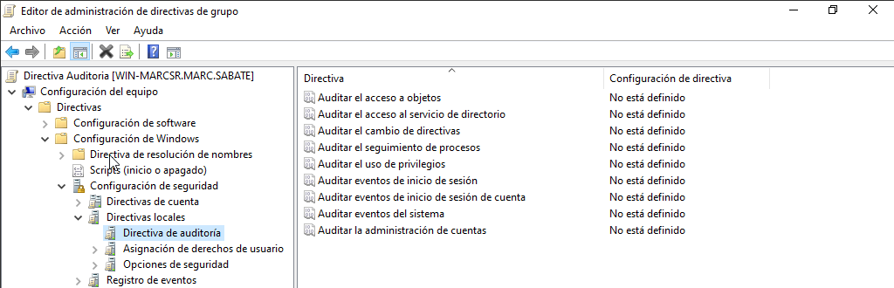
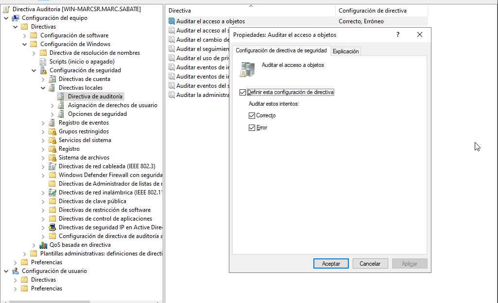
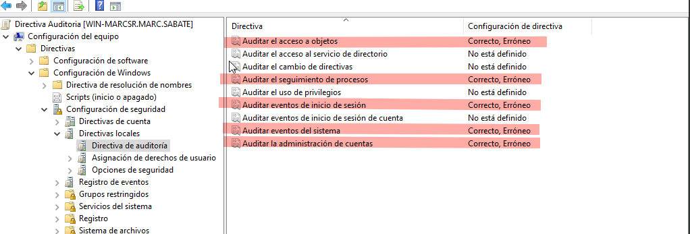
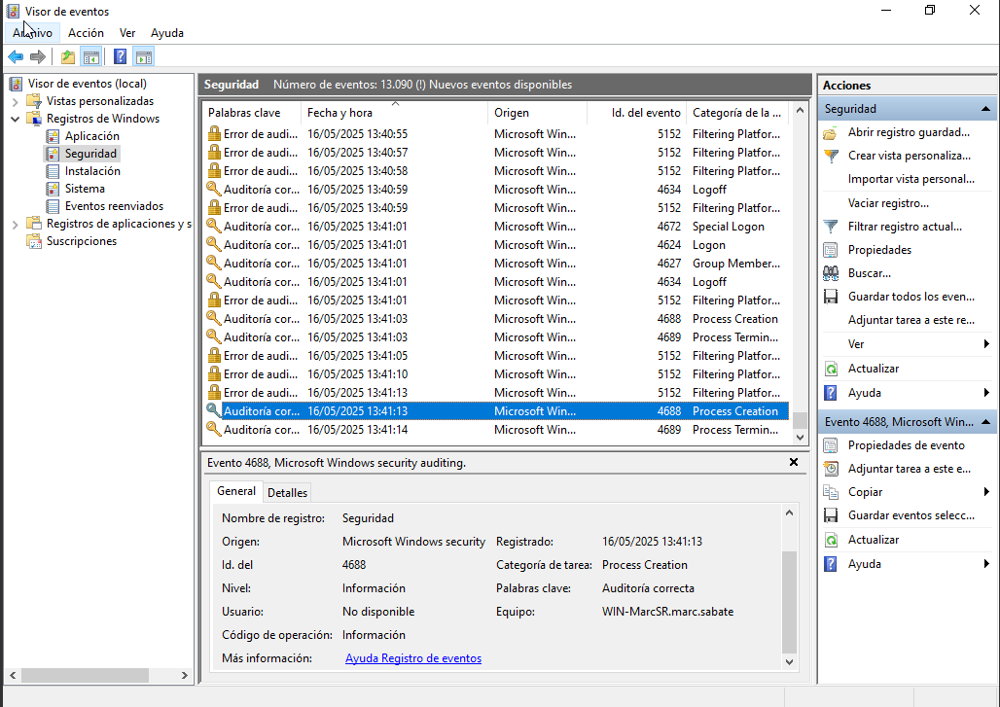
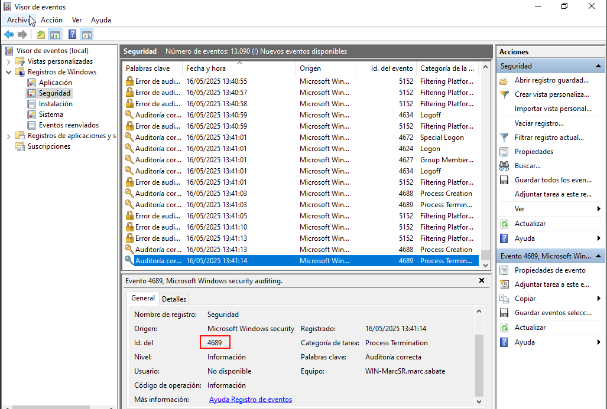
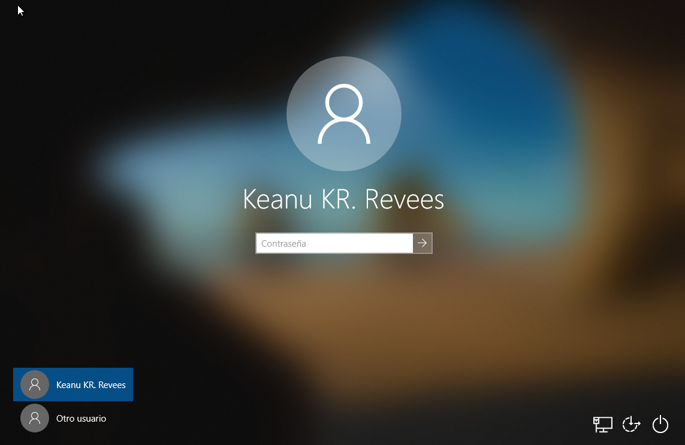
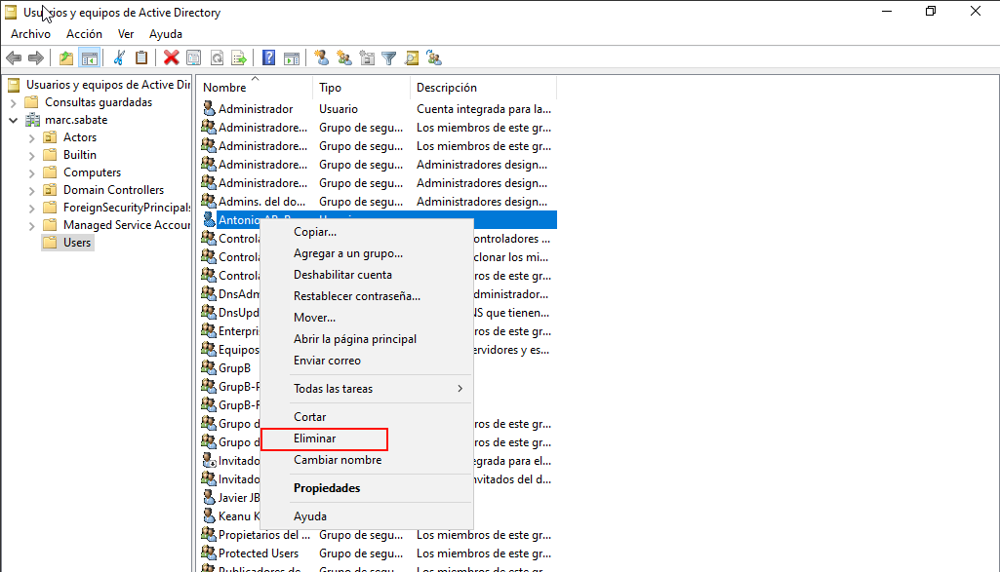
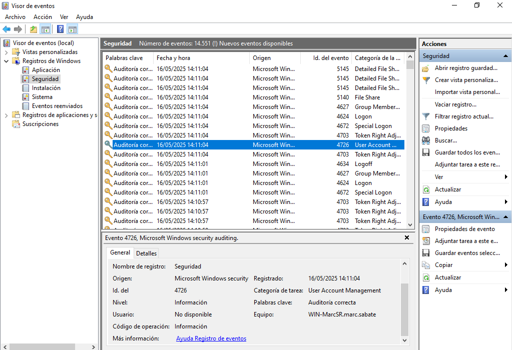

## Introducció
En aquest Sprint veurem com configurar una auditoria en un entorn WIndows serve i com actua sobre el client. Després també farem un monitoratge de l'auditoria.

## Auditoria Server

Per fer una auditoria amb Windows l'haurem de configurar a través de les GPOS, ho farem de la següent manera, entrant al llistat de configuració de windows, configuració de seguretat, directives d'auditoria i a partir d'aquí les configurarem.



- El següent pas serà definir quines politiques volem i com les monitoritzarem, podem configurar cadascuna per posar que sol funcioni amb error o amb l'estat correcte. La primera que configurarem serà la de accés a objectes.



- Per verificar i monitoritzar diferents accessos i events del sistema activarem totes les opcions marcades de la següent imatge.



- A continuació, des de l'eina de ```visor de eventos``` a l'apartat de seguretat veurem els processos que hem auditorat a la GPO, en aquest cas podem veure un process acabat de forma abrupta, aquest te una ID de 4869.




- Ara farem una prova d'inici de sessió d'usuari desde la màquina client. L'usuari Keanu es connectarà i nosaltres desde el visor de eventos haurem de veure una categoria Logon amb un ID 4624.



- La següent prova es eliminar un usuari del nostre AD i veure quin ID ens dona desde el visor. Eliminarem l'usuari Antoni Banderas i l'ID que ens apareixerà es el 4726.


