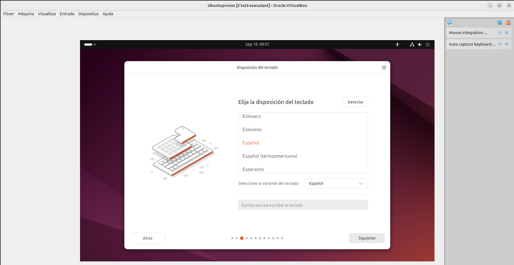
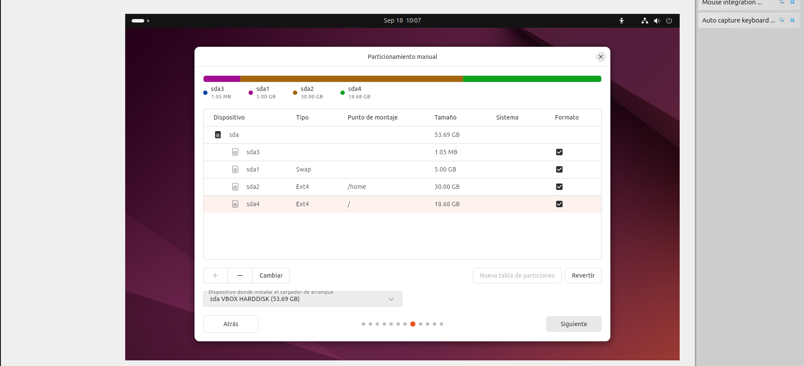
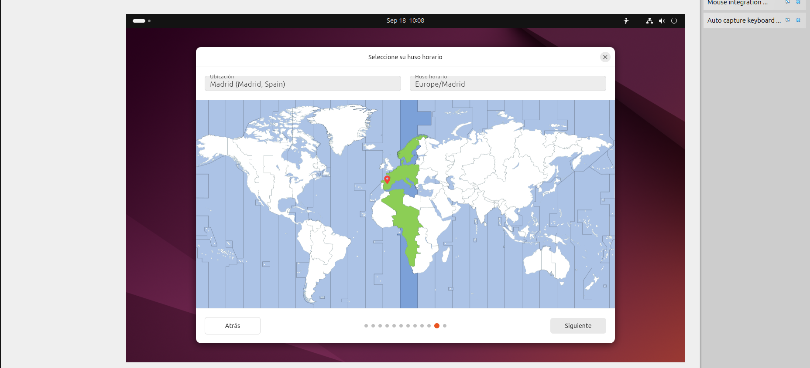
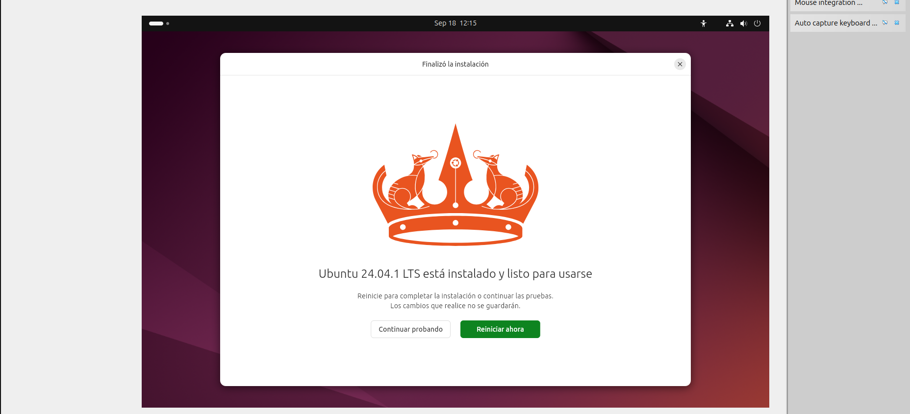

#Sprint 1

##Instal·lació, Configuració Inicial i Programari de Base

En aquesta primera part veurem el procés d'instal·lació d'una màquina virtual, les llicencies que te, com generar punts de restauració, com es fa la configuració de la xarxa, a instal·lar el programari i finalment com funciona un gestor d'arrancada.

##Instal·lació
En aquest apartat veurem pas per pas com fer l'instal·lació d'Ubuntu i les particions que li donarem al disc en el nostre cas.

Primerament hem de crear una màquina nova amb l'imatge ISO, seguidament li donarem l'enmagatzematge, procesadors i RAM. Un cop fet aquest pas abans de començar l'instal·lació hem de configurar la xarxa dedes les eines, en aquest cas escollim una NAT.

A les opcions de xarxa de ens connectem a la xarxa NAT que em creat prèviament.

Un cop tenim la coniguració prèvia, comencem l'instal·lació. Entrem a l'opció d'instal·lar.

Seugidament triem l'idioma

A continuació les opcions d'accecibilitat, disposició del teclat, la connexió a internet i per últim seleccionem l'opció d'instal·lar Ubuntu amb l'opció interactiva i seguidament la selecció predeterminada. No instalarem els programes recomanats. 

En aquesta opció de configuració seleccionarem la manual, aquí podrem determinar les parts del disco i segons la necessitat donar-li mes o menys espai a cada part.
En primera part designarem un espai de 5GB amb un format SWAP. A continuació un espai per a /home que es la carpeta on aniràn les apliacacions i documents, per tant li donarem 30GB amb format Ext4. I per últim un espai de 18,68GB a la partició on anirà situat el sistema operatiu. 

Per anar acabant amb l'instal·lació crearem una compta al nostre gust.

Finalment podem revisar les nostres opcions abans d'instalar. Un cop acabat reiniciem l'ubuntu i ja el tenim preparat per fer-lo servir.

##Llicenciament 

##Punts de restauració

##Configuració de xarxa bàsica de 

##Instalacions de programari

##Gestors d'arrancada