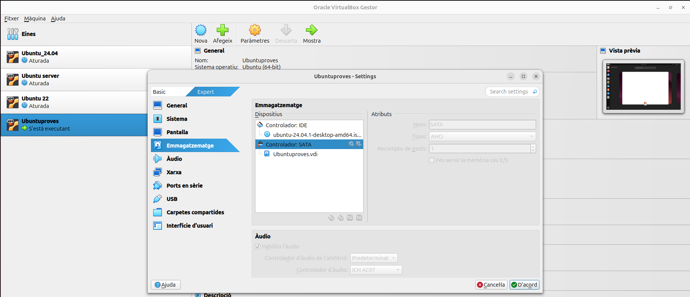
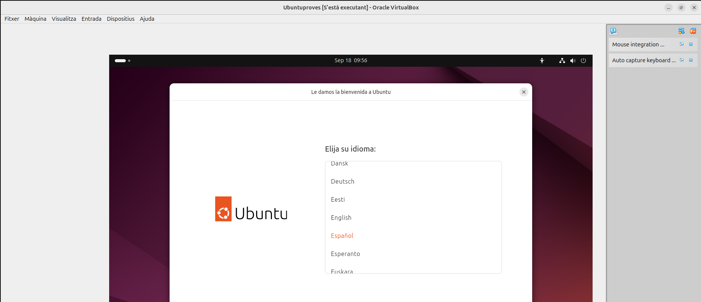
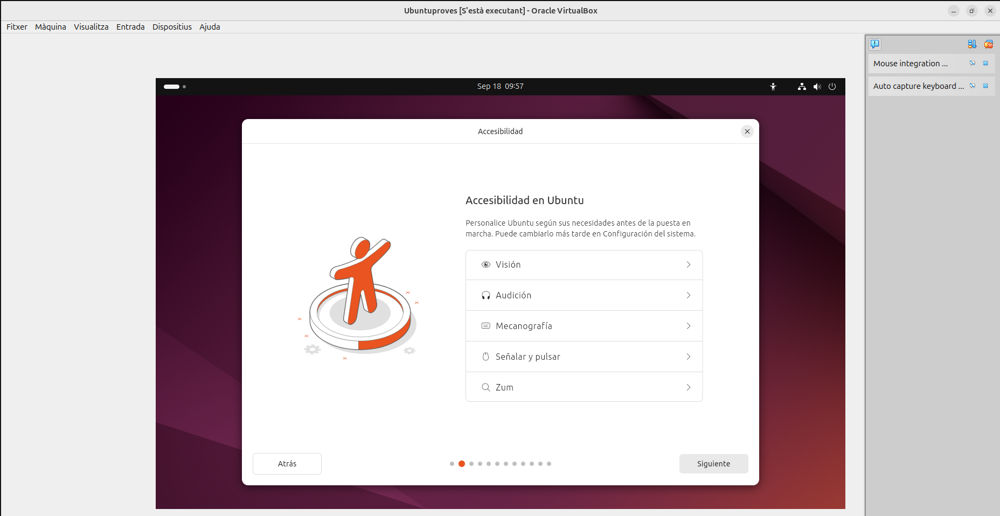
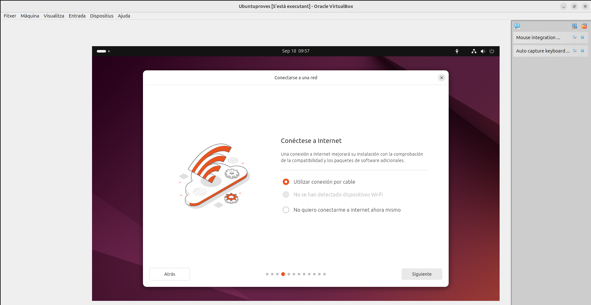
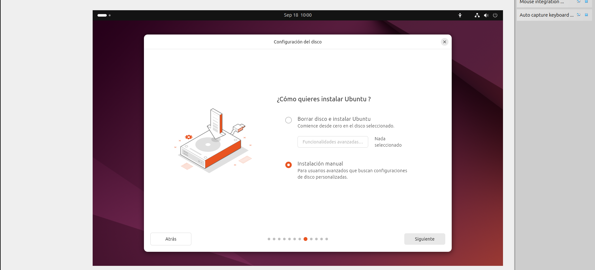
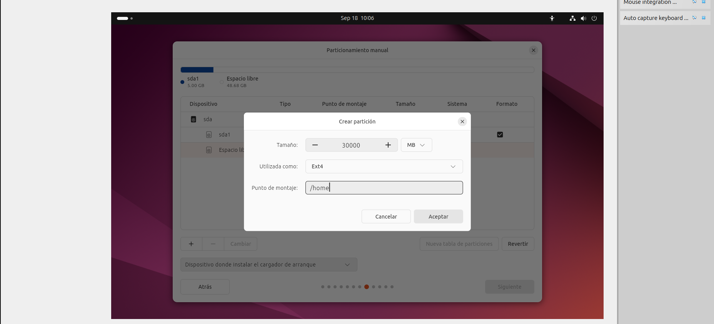
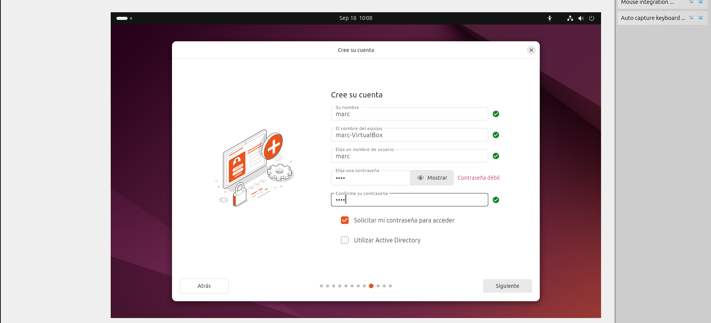

#Sprint 1

##Instal·lació, Configuració Inicial i Programari de Base

En aquesta primera part veurem el procés d'instal·lació d'una màquina virtual, les llicencies que te, com generar punts de restauració, com es fa la configuració de la xarxa, a instal·lar el programari i finalment com funciona un gestor d'arrancada.

##Instalació
En aquest apartat veurem pas per pas com fer l'instal·lació d'Ubuntu i les particions que li donarem al disc en el nostre cas.

##Llicenciament 

##Punts de restauració

##Configuració de xarxa bàsica de 

##Instalacions de programari

##Gestors d'arrancada