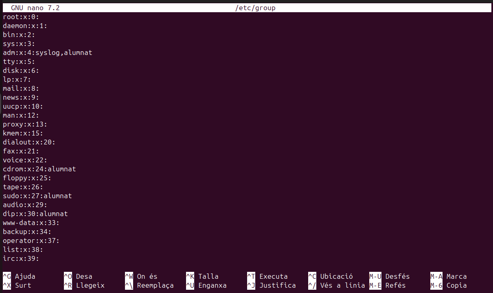
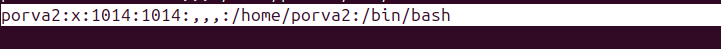
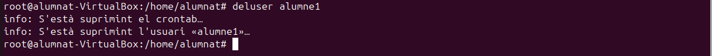
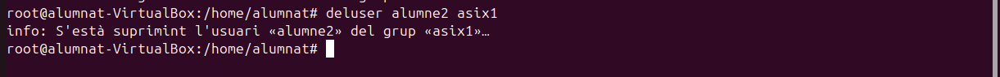
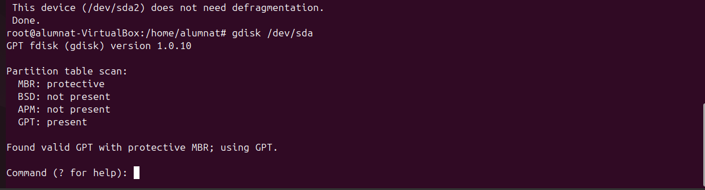

## Introducció
En aquest sprint veurem com es gestionen els usuaris, grups  i permisos d'un sistema en Linux. També configurarem les polítiques de seguretat per a comptes d'usuaris i per al sistema. Instal·larem i configurarem serveis i processos essencials del sistema operatiu, crearem i administrarem sistesmes de fitxers i noces particions. Implementarem un sistema de còpies de seguretat i per últim farem proves per comprovar el funcionament del sistema. 
# Gestió de processos
- En primer lloc definirem un procés. Aquest es un programa en execució que inclou dins seu: el seu codi, els recursos que te assignats i la seva execució. El procesos de linux poden ser en primer o en segon pla. Els que estàn en primer pla implequen una interacció amb l'usuari mentre que als de segon pla no es requereix aquesta interacció.
- La primera comada que utilitzarem per llistar els procesos es "pstree", aquesta ens mostrarà els processos actius que hi ha i quins son els seus fills si es que en té, tot això amb forma d'arbre, d'aquí el nom.
```
pstree
```


- Amb la mateixa comanda si volem saber a l'usuari que correspon i  a quin número de procés tenim ho podem realitzar amb les lletres h (usuari) i p (procés).
```
pstree -p -h usuari
```

- A continuació veurem com matar un procés, per això serà necessari saber quin número de procés li correspon a cadascun d'aquestos. En el cas de matar un procés pare tots els processos fills haurien de morir, tot i que hi ha una possibiltat de que algún quedi viu, i aquestos s'anomenen zombies.
- Per matar un procés utilitzarem la seguent comanda i el número de procés:
```
kill -9 (PID)
```
- Per fer la prova he utilitzat un altre terminal i m'he guardat el seu PID, per matar el procés tal i com es demostra a continuació:


- La comanda anterior fa una imatge dels processos, aquestos no canvien en temps real, per fer una consulta d'aquest tipus utilitzarem la comanda "top".
```
top
```
- Aquesta comanda ens dona molta informació per columnes, i ara veurem que vol dir cada columna. PID: Identificador únic del procés. USER: Usuari que inicia el procés. %CPU: Percentatge d'ús del processador. %MEM: Percentatge d'ús de la memòria RAM. COMMAND: Nom de la comanda o programa.

- En cas d'obrir un nou procés (ex: navegador) aquest ens apareixerà.

- La prioritat no es pot modificar directament, però amb el NI (nice) si que es pot canviar, contra mes baix es el número més prioritat té. Això es pot fer amb la següent comanda. Val a dir que caldria fer-ho des de el root ja que com sabem ens otorga més privilegis.

```
renice -n -nºprioritat -p PID
```


- Aquesta comanda serveix per moments determinats la prioritat per renice no es permanent.
- Seguidament també podem utilitzar la comanda "ps aux" que ens dona una informació similar però amb diferents parametres que veurem a continuació: USER: Usuari que ha iniciat el procés. PID: Identificador únic del procés. %CPU i %MEM: Percentatge de CPU i memòria RAM utilitzats pel procés. VSZ: Memòria virtual total utilitzada pel procés. RSS: Memòria física utilitzada pel procés. TTY: Terminal associat al procés ( ? si no en te). STAT: Estat del procés. R	Executant-se (Running). S = Inactiu. T = Pausat. Z = Procés zombi. I = Inactiu o sense consumir recursos. <	= Alta prioritat de CPU. s = Líder de sessió. l	= Multithread. + = Associat al terminal en primer pla.
```
ps aux
```

- Amb el ps podem fer varies combinacions per mostrar informació en concret a continuació veurem quines són i que fan.
```
ps -e
```
- Mostra tots els procesos del sistema amb una sintaxis estandar.
```
ps -ejH
```
- Mostra un arbre de procesos-
```
ps -eLf
```
- Mostra la informació dels fils (threads).
```
ps -eM
```
- Mostra informació de seguretat
```
ps -U
```
- Mostra tots els processos de root.

- A continuació veurem que són els processos amb segon pla i com passar processos a aquest estat. Com hem dit abans amb el kill -9 matem un procés i amb el ctrl+c l'aturem i amb el ctrl+z si que el passariem a segon pla. (Nota: segons el tipus de procés que aturem, si aquest va per terminal igaul no se'ns mostra en segon pla).
- La comada per veure els processos en segon pla es la següent.
```
jobs
```

- Un cop tenim aquest procés localitzat i no volem matar-lo sino que el volem enviar al primer pla podem utilitzar la següent comanda.
```
fg %nº 
```


- En cas de voler fer el procés invers i enviar un procés al segon pla podem utilitzar:
```
bg %nº
```
- En algun cas espacial igual volderm executar algun procés directament amb segon pla, i es pot fer de la seguent forma.
```
nomproces &
```
- A l'hora de consultar processos amb top em vist que es una eina en viu i que els processos que volem consultar es van movent i, a vegades se'ns pot fer complicat llegir-lo. En cas de voler evitar això i sol consultar el PID d'un procés en concret podem fer servir la següent comanda.
```
pgrep nomproces
```

- Un altra forma de fer-ho podria ser utilitzant comandes anteriors i afegir un grep, pero en algunes opcions com el ps aux pot quedar una mica confós, personalment ho recomano amb el pstree ja que així veurem també els processos fills.
```
pstree | grep nomproces
```

- Per acabar, si en algun moment volem utilitzar algún script o procés i que aquest tingui una prioritat predeterminada per nosaltres es pot fer amb el nice.
```
nice -n nºprioritat nomproces
```

- Amb un "top" podem comprovar si ha funcionat correctament.


# Gestió d'usuaris grups i permisos
## - Commandes terminal i accessos als directoris
Per a accedir al terminal normalment ho faremt amb un crtl + alt + t, així obrim el pseudo terminal. El terminal com a tal l'obrirem al el ctrl dret + F3, aquest es un terminal TTY. Un pseudo terminal es com un emulador on les comandes que posem son interpretades per algún arxiu al que fan referencia i aquest fa els procediments, en canvi amb un terminal si que estem amb contacte directe amb el sistema.

- En primer lloc per comprovar tots els usuaris que conte el nostre sistema ho farem amb la següent comanda. Els usuaris que es poden controlar per interfície gràfica es troben a partir del número 1000.
```
nano /etc/passwd
```

- A continuació podem veure els grups dels usuaris i l'identificador de qui es el seu administrador.
```
nano /etc/group
```

- A més a més també podem consultar les contrasenyes dels usuaris, això si encriptades i la seva caducitat.
```
nano /etc/shadow
```

- Per últim tenim una comanda que ensenya les contrasenyes del grup i la seva administració, també encriptat.
```
nano /etc/gshadow
```


## - Creació  d'usuaris
Per crear usuaris tenim diverses formes de fer-ho, el més important es tenir clar que amb certes comandes no es creen directoris sol usuaris. A continuació es mostrarà com crear usuaris.

- En primer lloc utilitzarem la següent comanda, aquesta ens creara un usuari pero fins que no fessim un log in amb aquest no ens crearà els directoris.
```
adduser usuari
```

- A continuació si volem crear l'usuari amb els seus directoris podem crear-lo amb la segûent comanda.
```
useradd usuari
```

- Per afegir els directoris haurem d'utilitzar la següent comanda.
```
mkdir usuari
```


- Si volem canviar el nom de l'usuari podem utilitzar la següent comanda. EN el cas que hi ha a continuació volem canviar el nom d'usuari de porva2, ja que hauria de ser prova2.
```
usermod -l usernou user
```



- En cas de voler eliminar accés a un usari ho podem fer bloquejant-lo, la comanda seria la següent. Una forma de comprovar que s'ha bloquejat correctament es entrar a la carpeta de passwd i veurem que la contrasenya del usuari al davant té un signe d'exclamació "!"
```
usermod -L usuari
```


- Seguint amb la creació d'usuaris, si tenim un usuari bloquejat i el volem recuperar utilitzarem aquesta comanda. A l'hora de comprovar-ho ens fixarem que ja no te l'exclamació.
```
usermod -U usuari
```

- Si realment el que volem es eliminar l'usuari de forma més permanent ho farem amb la següent comanda. Per comprovar si l'hem eliminat correctament podem entrar a la carpeta passwd i veurem que l'usuari ja no hi es.
```
deluser usuari
```



- Per complementar una mica les comandes que tenim, aquí en tenim algunes que ens poden ajudar també, la següent elimina la "home" de l'usuari.
```
rm -r usuari
```
- Un dels problemes habituals es que no eliminem les homes i directoris dels usuaris, amb la següent comanda ho podem fer tot a la vegada.
```
userdel -r usuari
```
- En cas de voler consultar algun tipus d'informació sobre algun usuari, podem fer-ho així.
```
id usuari
```


## - Creació de grups
- En aquest apartat veurem com funcionen els grups d'usuaris, com hem vist anteriorment podem consultar els grups i les seves contrasenyes. Important dir que quan es crea un usuari també es crea un grup amb el nom d'aquest. 
- Per crear un grup nou ho podem fer amb una senzilla comanda.
```
addgroup grup
```


- D'altra banda si el que volem es afegir un usuari a un grup existent ho podem fer d'aquesta manera.
```
adduser usuari grup
```


- L'operació anterior també es pot fer amb aquesta comanda.
```
gpasswd -a usuari grup
```
- Per fer a un usuari administrador d'aquell grup ho podem fer així. Dins de la carpeta gshadow podem veure els usuaris i administradors dels grups, per reconeixels veurem la posició que tenen entre els ":", l'alumne 2 es administrador d'asix1 i membre d'asix2.
```
gpasswd -A usuari grup
```


- Un dels majors problemes es que quan afegim usuaris a grups amb les comandes anteriors els treu del grup on estaven, per evitar-ho hem d'utilitzar la següent comanda. Com comprovarem l'usuari alumne2 forma part dels dos grups d'asix i es administrador del primer.
```
usermod -a -G grup usuari 
```


- Per eliminar un usuari d'un grup ho farem com veurem a continuació. En aquest cas l'alumne2 ja te prous responsabilitats i l'eliminarem del grup d'asix1.
```
gpasswd -d usuari grup
```


- L'anterior comanda també es pot fer amb aquesta altra
```
deluser usuari grup
```


- Per fer un usuari el principal d'un grup en concret utilitzarem el següent.
```
usermod -g grup usuari
```
- En cas de voler canviar el nom d'algun grup ho farem amb la següent comanda.
```
groupmod -n grupnou grupvell
```


# Gestió de permisos
En els casos d'un sistema multiusuari on vulguem que diferents usuaris tinguin certs permisos però no els mateixos, és important fer una bona gestió d'aquestos. Hi han vaires maneres de gestionar-ho, i les veurem a conitnuació.

## - Permisos estandars
- Els permisos estandars son una serie de permisos bàsics que es poden donar a tots els usuaris i grups. Els grups poden tenir diferents permisos respecte als usuaris, una forma de comprovar això ho podem fer de la següent forma.
```
ls -l 
```

- En aquest cas podem observar que el primer root que apareix és de l’usuari i el segon és del grup principal. També surt la data de creació i noms de directori, però la part important és al principi.

-  Aquí es on podem apreciar els permisos que hi han dins dels directoris. Després de la lletra d, els primers permisos són els d'usuari "rwx" en aquest cas, això vol dir que por llegir, escriure i executar, bàsicament te tots els permisos. Després els següents permisos son els de grup equivalents a les 3 lletres següents: "r-x", en aquest cas com podem veure no te permisos per escriure. I per últim tenim els ultims 3 caràcters que equivalen a altres, usuaris que no són ni usuari principal ni formen part del grup principal, en aquest cas: "r-x", la mateixa situació que abans no poden escriure però si llegir i executar. Aquest exemple es amb "root".
- A continuació veurem com nosaltres podem agregar permisos als usuaris i grups. 
```
chmod -R
```
- Opcions de fitxer/carpeta
```
chrgp -R
```
- Grup propietari fitxer/carpeta
```
chown - R
```
- Propietari fitxer/carpeta.
- Cada lletra dels permisos te un significat associat: u = usuari, g = grup, o = others, a = all.

## - Permisos especials
### - Sticky
- L'sticky es un permís d'accés per fitxers i directoris. Quan l'apliquem l'únic usuari que el pot canviar es el root. Es pot aplicar de la següent manera.
```
chmod +t directori
```
```
chmod 1775 directori
```
- Això es molt útil en sistemes multiusuari ja que sol el root i l'usuari que ha creat cert directori poden borrar o modificar el directori, els altres sol tenen permisos de lectura o escriptura. En cas de voler eliminar l'sticky podem utilitzar la següent comanda.
```
chmod -t directori
```
### - sgid
- sgid es un permís que esta relacionar amb els grups i principalment permet que qualsevol usuari executi l'arxiu com si fos part del grup al que pertany aquell arxiu. Per utilitzar-la podem fer el següent.  
```
chmod g+s
```
### - suid
- suid permet que un arxiu s'executi com si fos el propietari independentment de l'usuari que l'executi. Aquest a diferencia del sgid i sticky no es pot fer un script.
```
chmod g+s 
```
## - Llistes de control d'accés (ACLs)
- Una llista de control d'accés son una serie de regles que ens permeten uns accesos a sistemes de fitxers en aquest cas. Aquestes llistes ens poden donar uns accesos mes restrictius o mes permisius segons la configuarció que faci l'usuari. Per crear una ACL utilitzem la següent comanda.
```
setfacl
```
```
setfacl -m user:usuari:rw- exemple.text
```
```
setfacl -m group:grup:rwx carpeta
```
```
setfacl -b fitxer o carpeta
```
- Les restriccions venen donades per les lletres com hem vist abans, utilitza la mateixa nomenclatura. Per comprovar si les restriccions s'han aplicat correctament podem utilitzar la següent comanda.
```
getfacl
```


- Si ens em equicocat a l'hora de configurar alguna ACL podem eliminar totes les excepcions. (TOTES).
```
setfacl -x usuari carpeta
```
## - Umask
- Umask s'utilitza per canviar la mascara del mode de creació d'arxius, auesta determina el valor inicial dels permisos que tindran els arxius que es creein. De forma predeterminada la mascara te el valor dels bits de permís que NO s'han d'establir, per això fem l'operació de negació. Amb les seguents imatges entendrem millor la situació.


- El que esta fetn umask es una operació coneguda com NOR, el que equivaldria a una resta convencional.
- Aquestes operacions es poden realitzar amb la següent comanda, tot i que això sol funcionarà temporalment (els arxius ja creats no canvien de permisos).
```
umask + nº
```
- Per a que els canvis siguin permanents tenim que modificar la umask al arxiu que tenim a la següent ruta.
```
/etc/login.defs
```
- Un cop obert l'arxiu modifiquem el valor de la umask per defecte i aquest canvi si que es permantent.


# Sistemes de fitxers i particions
## - Estructura de la informació
- L'estructura de la informació la podem dividir en diverses parts: la física que seria el disc (sòlid o mecànic), i l'estructura lògica que pot ser (gpt o mbr). La part lògica pot ser consultada a través de commandes per la terminal tal i com es mostra a continuació:
```
gdisk /dev/sda
```

- Els discs estan dividits amb blocs i dins de cada bloc tenim uns sectors. El sector és la unitat mínima física on es guarden les dades i per defecte és 512 bytes, però el SO no treballa en sectors treballa en blocs. El bloc és la unitat mínima lògica on es guarden les dades per defecte. La mida del sector no es pot canviar ve definida de fàbrica, però la mida del bloc si es pot canviar. Quan formatem la partició. Per consultar les mides del sector podem utilitzar les seguents comandes.
```
fdisk -l
```


- Com hem vist també ens surt on es troba instalat el sistema operatiu (part resaltada de l'imatge anterior). Per seguir analitzant les mides de les particions podem utilitzar la següent comanda.
```
tune2fs -l /dev/sda | grep Block
```

- Seguidament si necessitem saber la informació de les particions i sistemes de fitxers que s'utilitzen podem utilitzar aquesta comanda.
```
df -T
```
 
- Les mides dels blocs segons el tipus de fitxers que es guardin ens pot donar problemes, ara veurem dos possibles problemes amb les seves respectives solucions.
### - Fragmentació interna
La fragmentació interna és l’espai que desaprofitem dels blocs perquè no s’acaben d’emplenar. Una solució possible és canviar la mida del block reduïm la fragmentació interna, però pots fragmentar un arxiu (baixes el rendiment), busquem un equilibri. Aquesta canvi de mida per reduir l'espai del bloc ens pot servir si emmagatzemem arxius que no tinguin una mida molt gran, com podiren ser els fitxers de text. D'altra banda si volem guardar fitxers mes grans com podrien ser pel·licules o ISOs em de fer més gran la mida del bloc perqué sino fragmentarem molt els arxius. RECOMANACIÓ! buscar sempre un equilibri i emmagatzemar els tipus d'arxius diferents en particions diferents, per no barrejar "pelis amb textos".
### - Fragmentació externa
La fragmentació externa és quan el disc fa temps que treballa i els arxius es guarden en blocs separats i no continus, això ens fa baixar el rendiment, aquesta baixada de rendiment es pot solucionar desfragmentant el disc. La desfragmentació intenta ordenar els arxius per a que no estiguin .

## - Tipus de formateig
Hi ha tres maneres de formatar un disc i son les següents.

- Ràpid: Aquest formateig no borra els arxius, elimina el sistema de fitxers i en cas d'haver-hi un bloc defectuos s'ignora.

- Nivell mig: Aquest tampoc elimina els arxius sinó que elimina el sistema de fitxers igual que ho fa el ràpid, la diferencia es que el mig detecta i marca els sectors i/o blocs defectuosos, sense reperar-los.

- Nivell baix: En aquest igual necessitem algún programa extern. I en aquest cas si es borren els arxius, es borra tot i intenta reparar els blocs defectuosos. És el més lent dels tres. Amb commandes també tal i com es mostra a continuació. Hi ha una command per mostar la cantitat de fragmentació que tenim a la partició en concret (ens recomana si em de desfragmentar o no), i després una altra per desfragmentar-lo.
```
e4defrag -c /dev/sda2 (consulta)
```
```
e4defrag /dev/sda2 (desfragmentació)
```


# Copia de seguretat i automatització de tasques

# Quotes de disc

# Enllaços d'interés
```
https://wiki.archlinux.org/title/Umask_(Espa%C3%B1ol)
```
