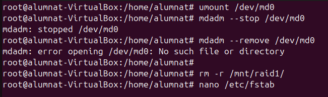

## RAID
EL RAID es una eina que ens permet combinar diversos discs en una sola unitat lògica per dona redundancia a les dades. Així en cas de perdua poden recuperar. Hi han diferents tipus de raids:

- RAID 0: Avui en dia es considera obsolet. Consisteix en dividir les dades i distribuir-les entre discs sense redundancia. El nivell de seguretat es pràcticament nul, ja que pots perdre les dades fàcilment.


- RAID 1: Funciona amb el metode "espill" que consisteix en fer una copia exacta de les dades en un altre disc, això ens dona redundancia (es com un copia de seguretat en temps real).


- RAID 5: Utilitza com a minim tres discs, tot i que també es pot fer amb quatre. El sistema d'emmagatzematge reparteix l'informació entre tots els discs menys a un que es l'utilitzat per la paritat, en cas de fallar un disc pots recuperar l'informació.


- RAID 6: El funcionament es exactament igual que l'anterior, la diferencia principal es que la paritat es guarda en dos discs.


## RAID 1

En aquest primer apartat veurem com configurar un RAID1. 

- EN primer lloc necessitem el paquet mdadm, que es el que ens permet instal·lar i configurar els RAIDs


- Un cop el paquet esta instal·lat configurarem els discs amb la comanda que ja coneixem ```fdisk``` els discs que modifiquem hauràn de cumplir la següent configuració-


- En acabar la configuració consultarem les particions i disc de la nostra màquina i ens assegurarem de que el format tingui autodetecció de RAID Linux.


- A continuació crearem una carpeta per fer proves, i li doanrem els permisos que es mostren a continuació.


- A continuació donarem el format al RAID amb aquesta comanda, el que fem es basicament crear el RAID amb el nivell que es el número de RAID i després indiquem el número de dispositius i quins son. 
```
mdadm --create /dev/md0 --level=1 --raid-devices=2 /dev/sdb1 /dev/sdc1
```


- Ara donarem el format d'arxius a l'array del RAID, amb la següent comanda.
```
mkfs.ext4 /dev/md0
```


- Per comprovar que s'ha creat tot correctament utilitzarem la comanda: 
```
mdadm --detail /dev/md0
```


- Seguidament executarem les següents comandes per crear un fitxer de configuració per al RAID.
```
mdadm --detail --scan > /etc/mdadm/mdadm.conf
```


- Dins del fitxer escriurem la següent linea ```DEVICE /dev/sdb1 /dev/sdc1```.


- Com ja sabem per muntar permanent el RAID haurem de consigurar el fitxer fstab 


- Un cop feta la configuració reiniciem els serveis. Muntarem el disc i utilitzarem la següent comanda ```update-initramfs -u -k all```.


- Després de fer tots els passos comprovarem que el RAID esta correctament configurat un cop es reinicia el sistema.


- Crearem una serie de directoris i fitxers per fer proves 


- A continuació treurem un disc i veurem que podem seguir treballant amb les dades. Com es pot apreciar el disc que hem desmuntat es troba en estat ```faulty```.
```
mdadm /dev/md0 -f /dev/sdb1
```


- Un cop fet el pas anterior eliminarem el disc amb el modificador ```-r``` i veurem que el seu estat passarà a ser ```removed```.


- Igualment podrem accedir a les dades 


- Amb la mateixa comanda que hem utilitzat anteriorment amb el modificador ```-a``` afegirem de nou el disc. Com es pot apreciar primer trigarpa una estona ja que estarà amb l'estat ```spare rebuilding``` passat un temps si tornem a detallar el RAID veurem que es troba en estat actiu.


- Seguidament simularem un cas en el que un dels discs es trenca o te algun problema i es substituit per un de nou. Un cop hem extret el disc si fem un detail del RAID veurem que sol ens apareix un.


- Per continuar aturarem tots els serveis i reinicaiarem el RAID toranant-lo a muntar. Veurem que les dades segueixen estant segures. I amb un detail veurem l'estat del RAID.


- Per acabar afegirem el nou disc a la màquina i seguint la configuració del principi el muntarem i prepararem. Tal i com ha passat abans amb el disc que hem desmuntat, quan posem un disc nou l'estat al RAID passa a ser ```spare rebuilding```, un cop acaba, veiem que passa a actiu i que les dades segueixen allà.


- Finalment, esborrarem el RAID de forma definitiva. Es important tindre amb compte que l'estat del superblock es permanent. Llavors haurem de seguir les comandes següents:
```
umount /dev/md0
```
```
mdadm --stop /dev/md0
```
```
mdadm --remove /dev/md0
```
```
rm -r /mnt/raid1
```


- Un cop hem parat els sistemes hem de eliminar les linies que hem creat al arxiu ```fstab``` i al ```mdmda.conf```.


- Com ja he esmentat abans, sino eliminem del tot el superblock la RAID seguirà sense esborrar-se. Per tant les següents comandes son molt importants. Un cop executades podem fer un reinici del servei i del sistema.
```
mdadm --zero-superblock /dev/sdb1 /dev/sdc1
```
```
systemctl daemon-reload
```


