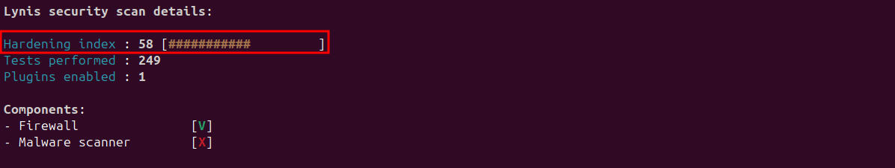
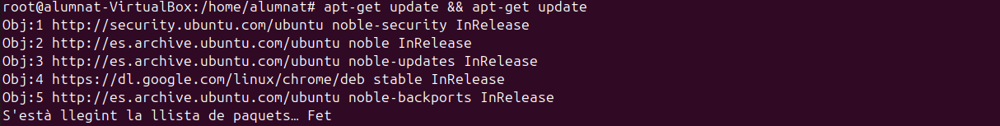
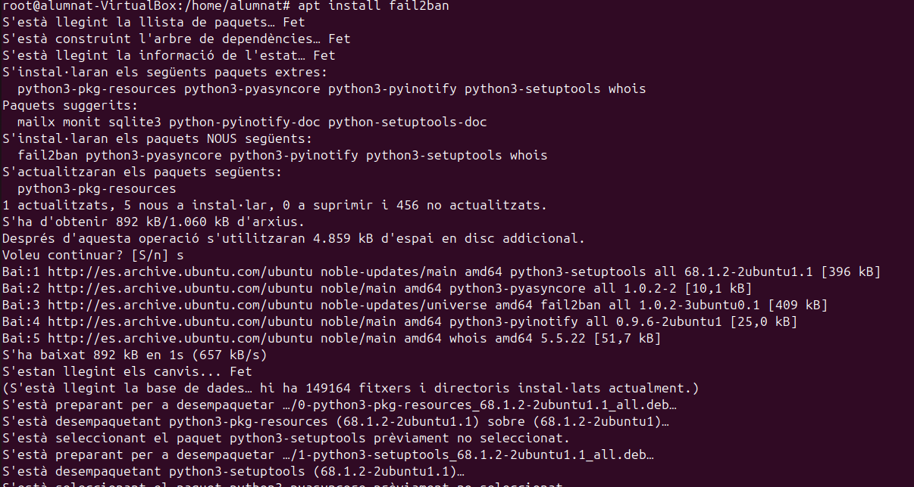

## Introducció
En aquest sprint veurem com funciona la monitorització tant de Logs del sistema, ja sigui de forma remota o local; i també com funcionen les eines d'Ubuntu per monitortizar el rendiment de la nostra màquina.
A més a més, descriurem com fer que un dispositiu ens serveixi per fer de servidor d'actualitzacions. I per últim utilitzarem l'eina Lynis per simular una auditoria.

## Monitorització
### LOGS

Els LOGS son una serie de registres que emmagatzemen informació de tot el sistema, són una font de registres de totes les parts del sistema i recopilen tot tipus d'informació que ens pot ser rellevant, per això ens interessa monitoritzar-los. Poden haver logs del sistema i logs d'aplicacions .

- La majoria d'aquestos LOGS es troben al directori ```/var/log```. Com podem apreciar hi ha logs de tot tipus.


- Un de les coses que podem fer amb aquestos LOGS es actualitzar la seva rotació ja que tampoc ens interessa que estiguin vagant pel sistema eternament, aixi que configurarem el fitxer ```/etc/logrotate.conf``` per assignar-los un tipus de rotació, per exemple setmanalment.


- Dins del direcotri ```/etc/logrotate.d``` podem configurar alguna rotació de logs en concret.
[LOG2](LOG2.png)

- Per provar com configurar la rotació d'un log en concret escollirem els logs de dpkg en aquest cas. lA configuració ens mostra que els arxius rotaran cada mes que d'aquests es conservaran els últims 12 arxius de logs antics abans d'eliminar-los, que els antics es comprimiràn, i que la compressió es farà després de la rotació. Finalment es donaran els permisos.


- Ara veurem els logs del sistema al fitxer ```/etc/rsyslog.d/50-defaul.conf```, en aquest fitxer podem configurar quins logs es mostren i quins no al fitxer al qual estan assignats. ```Després de modificar-lo s'ha de reiniciar el servei```.


- Per fer una prova enviarem una alerta al servei de mail i després farem un cat al arxiu on es guarden els logs del mail per veure si ha registrat l'alerta.


- Ara, el que volem es que TOTES les alertes de nivell critic quedin registrades a una nova carpeta, on podrem analitzar tots els logs d'alerta critica. Com hem dit abans si modifiquem aquest arxiu s'ha de reiniciar el sistema.


- A continuació, per comprovar que els canvis funcionen crearem una alerta critica anomenada Bomba, i llavors consultarem la carpeta dels logs que hem creat per comprovar si realment apareix la bomba.


#### - Journal

El journal consulta el fitxer systemd journal, que unifica logs de diferents serveis i components del sistema en un sol lloc. En canvi el cat sol ens mostra informació d'un sol fitxer, el que estem consultant.

- En aquest cas farem la consulta ```journalctl -p crit```, el -p filtra els registres i el crit els que son critics. El resultat ens mostra errors del RAID, un error d'autenticació que em va passar per equivocar-me amb la contrasenya tres cops, i després la BOMBA i les alertes que hem generat.


#### - LOGS en xarxa
##### -Receptor
- El primer pass es configurar el dispositiu que rebrà els logs. Instal·lant el següent paquet i modificant l'arxiu ```/etc/rsyslog.conf``` seguint els passos que es mostraràn que són treure el comentari de ```module``` i ```input```. 
```
sudo apt install rsyslog
```


- Un cop desada la configuració farem un reinici del servei rsyslog i obrirem els ports per a que el tallafocs ens permeti la connexió.


##### -Emissor
- El següent pas es configurar el dispositiu que rebrà els LOGS. Torenem a instal·lar el paquet ```rsyslog``` i configurarem el fitxer ```/etc/rsyslog.conf```. El més important es posar l'ip correctament


- En acabar la configuració de l'arxiu a la màquina ```receptor``` utilitzarem la comanda tail -f/var/log/syslog.


- Ara ens situem a ```l'emissor``` on farem un intent fallit de connexió com a root per generar un log.


- Finalment desde la màquina ```receptor``` veurem que ens arriba un registre amb l'ip de l'altra màquina.


### - Rendiment

Per visualitzar el rendiment podem utilitzar una eina propia d'Ubuntu, el monitor del sistema. 


- En aquest monitor podem llistar els processos, recursos i arxius del sistema. 


- A continuació executarem un procés per veure els recursos que consumeix, la prioritat i l'usuari que l'executa. Això ens pot servir per detectar alguns processos que tinguin molt consum o bé que siguin d'un usuari que no hauria d'executar-los.


- Aquí podem veure altres processos ordenats per us de la cpu amb %.


- Per acabar també podem veure el consum de recursos de forma gràfica.


# Servidor actualitzacions

Un servidor d'actualitzacions es un servidor al qual diversos equips clients estàn connectats i agafen els paquets d'actualitzacions d'aquesta màquina servidor, així no col·lapsem els serveis si molts clients es volen descarregar un paquet a la vegada. Per comprovar el funcionament d'aquesta metodologia utlitzarem l'eina apache.

## - Servidor

- En primer lloc, instal·larem el paquet apache.


- Segudiament, instal·larem el paquet mirror, que serà el que ens permetrà copiar qualsevol cosa que tinguem en un directori a un altre, com si fos un mirall.


- A continuació, al fitxer ```/etc/apt/mirror.list``` configurarem el paquet d'instal·lació de google chrome. 


- Un cop tenim aquest fitxer modificat executarem l'apt-mirror 


- Després, ens assegurarem que a la carpeta del mirror hi hagi el paquet d'instal·lació del chrome de la següent manera:


Si hem seguit tots aquests passos la part de configurar el servidor ja ha finalitzat, ara procedirem a la configuració del client per poder accedir al instal·lador del chrome del client al servidor.

## - Client

- El primer pas és afegir la clau GPG de Google al sistema. Aquesta clau s'utilitza per verificar la integritat i autenticitat dels paquets descarregats des dels repositoris de Google, en aquest cas Chrome.


- A més a més, al fitxer ```ubuntu.sources``` afegirem la ruta del paquet del chrome, però, amb la IP del nostre servidor.


- Seguidament, modificarem l'arxiu ```/etc/apt/sources.list.d/ubuntu.sources``` que aquí també li indicarem que els paquets que volem que instal·li tinguin la ruta del nostre servidor, així ens assegurem de que els extreu del servidor.


- Finalment, llançarem un update al client per veure si realment utilitza les rutes que apunten al servidor, i ens fixarem si els paquets contenen la IP d'aquest.


- Per acabar, veurem que si que agafa els paquets del servidor, sol ens quedaria verificar que s'ha instal·lat el chrome correctament.


# Auditoria

## - Lynis

- El primer pas que hem dur a terme es fer un update, un cop acabat instal·larem el Lynis
```
sudo apt install lynis -y
```

- Un cop tenim el paquet instal·lat executarem el programa per fer un escaneig al sistema.
```
lynis audit system
```

- Un cop executada aquesta comanda el programa començarà un escaneig de tot el sistema i els seus apartats, per cada part ens detallarà l'estat si esta correcte, no trobat, o amb algun error. I per últim ens mostrarà un resum amb els detalls del que ha escanejat.


- En cas de voler fer un escaneig ràpid podem utilitzar la següent comanda. El resultat es similar a l'anterior.
```
lynis -Q
```


- Als dos escaneigos que hem realitzat ens trobarem que hi ha un apartat de sugerencies per millorar la seguretat del nostre dispositiu, i com podrem veure al resum detallat, ens diu el nivell de "hardening index" que vindria a ser un índex de nivell de seguretat.



- Per millorar aquest index, podem començar instal·lant i seguint els passos de les propostes, l'únic porblema es que el paquet ```listbugs``` ha quedat obsolet i ara es diu ```listchanges```. A continuació mostraré com instal·lo diversos paquets i el resultat de la millora del índex.





